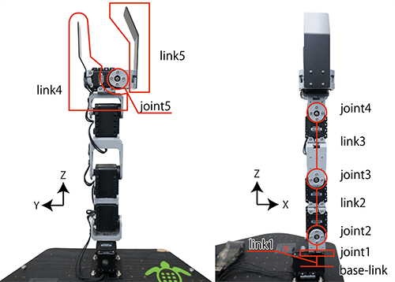
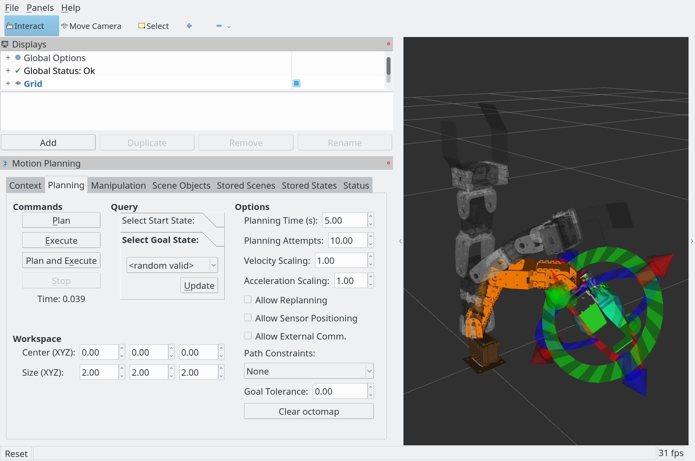

## Crane+V2 Robot Arm

Code and models for the [Crane+V2 5DOF](https://www.rt-net.jp/products/cranep2?lang=en) (4DOF arm + gripper) with the [MoveIt! Framework](http://moveit.ros.org/) in ROS.

Based on the [TurtleBot Arm code](https://github.com/turtlebot/turtlebot_arm).


#### Robot Arm Description

<div style="width:image width px; font-size:80%; text-align:center;">
</div>


[Source](https://www.rt-shop.jp/blog/archives/6711)

#### Motion Planning with MoveIt! Framework in RViz 

<div style="width:image width px; font-size:80%; text-align:center;">
</div>


## Requirements

- [Ubuntu 16.04 Xenial](http://releases.ubuntu.com/16.04/)
- [ROS Kinetic](http://wiki.ros.org/kinetic/Installation/Ubuntu)
- [Moveit! Motion Planning Framework](http://moveit.ros.org/install/)
- [Dynamixel Motor](http://wiki.ros.org/dynamixel_motor) ROS package

This package has only been tested on Ubuntu 16.04 with ROS Kinetic. 

## Packages

**camera_plus_description**

​	CAD files and [URDF](http://wiki.ros.org/urdf) (Unified Robot Description Format) model of CRANE+V2

**camera_plus_gripper**

​	Node that controls the gripper of CRANE+V2

**camera_plus_hardware**

​	Launch file that launches and configures the settings for use with CRANE+V2 hardware

**camera_plus_ikfast_arm_plugin**

​	Inverse kinematics plugin for CRANE+V2 in the MoveIt! framework

**camera_plus_joint_state_publisher**

​	Node that converts servo status messages (`dynamixel_msgs/JointState` type) output by the Dynamixel servo controller to ROS `sensor_msgs/JointState` type

**camera_plus_moveit_config**

​	Parameters and launch files for using CRANE+V2 with MoveIt! framework

**camera_plus_simulation**

​	Launch file that launches and configures the settings for simulating CRANE+V2 in Gazebo

​	

## Quick Launch

Please see [instructions below](#ros-installation-and-configuration) for first time ROS installation and configuration.

1. Install the required packages

    ```bash
    $ sudo apt-get install ros-kinetic-moveit-*
    $ sudo apt-get install ros-kinetic-dynamixel-motor
    ```

2. Download the project files and compile the project

    ```bash
    $ cd ~/catkin_ws/src/
    $ git clone git@gojou:charyeezy/Crane_V2_ROS.git
    $ cd ~/catkin_ws && catkin_make
    $ source ~/catkin_ws/devel/setup.bash
    ```

3. Launch the hardware node to set up interface between ROS and hardware

    ```bash
    $ roslaunch crane_plus_hardware start_arm_standalone.launch
    $ roslaunch crane_plus_moveit_config move_group.launch
    $ roslaunch crane_plus_moveit_config moveit_rviz.launch config:=true
    ```

4. Launch with simulation

    ```bash
    $ roslaunch crane_plus_simulation simulation.launch
    $ roslaunch crane_plus_moveit_config move_group.launch
    $ roslaunch crane_plus_moveit_config moveit_rviz.launch config:=true
    ```

## ROS Installation and Configuration

[Install](http://wiki.ros.org/kinetic/Installation/Ubuntu) ROS Kinetic 

```bash
$ sudo apt-get update
$ sudo apt-get upgrade
$ sudo sh -c 'echo "deb http://packages.ros.org/ros/ubuntu $(lsb_release -sc) main" > /etc/apt/sources.list.d/ros-latest.list'
$ sudo apt-key adv --keyserver hkp://ha.pool.sks-keyservers.net:80 --recv-key 421C365BD9FF1F717815A3895523BAEEB01FA116
$ sudo apt-get update
$ sudo apt-get install ros-kinetic-desktop-full
$ sudo rosdep init
$ rosdep update
$ echo "source /opt/ros/kinetic/setup.bash" >> ~/.bashrc
$ source ~/.bashrc
$ sudo apt-get install python-rosinstall python-rosinstall-generator python-wstool build-essential
```

[Configure](http://wiki.ros.org/ROS/Tutorials/InstallingandConfiguringROSEnvironment) your ROS environment

```bash
$ mkdir -p ~/catkin_ws/src
$ cd ~/catkin_ws/ && catkin_make
$ echo "source ~/catkin_ws/devel/setup.bash" >> ~/.bashrc
$ source ~/.bashrc
```

Confirm the installation and configuration of ROS. You should see the following output.

```bash
$ printenv | grep ROS
ROS_ROOT=/opt/ros/kinetic/share/ros
ROS_PACKAGE_PATH=/home/<username>/catkin_ws/src:/opt/ros/kinetic/share
ROS_MASTER_URI=http://localhost:11311
ROS_VERSION=1
ROSLISP_PACKAGE_DIRECTORIES=/home/ubuntu/catkin_ws/devel/share/common-lisp
ROS_DISTRO=kinetic
ROS_ETC_DIR=/opt/ros/kinetic/etc/ros
```

