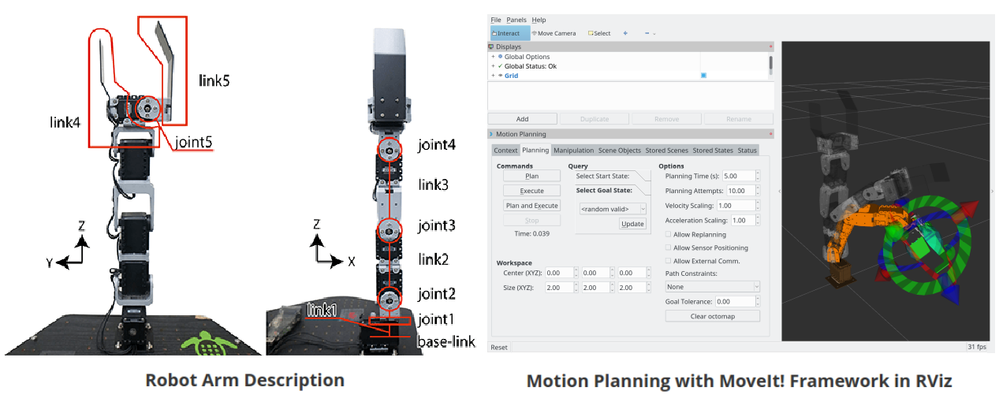

## Crane+V2 Robot Arm

Code and models for the [Crane+V2](https://www.rt-net.jp/products/cranep2?lang=en) (4DOF arm + gripper) with the [MoveIt! Motion Planning Framework](http://moveit.ros.org/) for [ROS](http://wiki.ros.org/).




## Contents

- [Environment Setup](#environment-setup)
- [Package Description](#package-description)
- [Quick Start](#quick-start)
- [Setting Up a VM](#setting-up-a-vm)
- Crane Plus Control: [Parameter Tuning](./crane_plus_control/README.md)


## Environment Setup

- [Ubuntu 16.04 LTS](http://releases.ubuntu.com/16.04/)
- [ROS Kinetic](http://wiki.ros.org/kinetic/Installation/Ubuntu)
- [Python 2.7](https://www.python.org/download/releases/2.7/)

This package has only been tested on Ubuntu 16.04 LTS with ROS Kinetic. ROS is currently only stable on Python 2.7 due to compatibility with legacy packages. 

If you do not have Ubuntu 16.04 LTS or want to run on Windows machine, an option is to download the [ISO](http://releases.ubuntu.com/16.04/ubuntu-16.04.5-desktop-amd64.iso) and install on a VM such as [VMWare Workstation Player](https://www.vmware.com/products/workstation-player/workstation-player-evaluation.html) [(setup)](https://www.youtube.com/watch?v=Wmx5hZ_m7EY) or [Virtualbox](https://www.virtualbox.org/wiki/Downloads) [(setup)](https://www.youtube.com/watch?v=RBU1xMP-SGc).  See [below](#setting-up-a-vm) for further instructions.

If you wish to run ROS along with Python 3 in Anaconda, please [create a py2.7 conda environment](https://www.youtube.com/watch?v=EMF20z-gT5s) for ROS.

```bash
$ conda create -n ros_env python=2.7 anaconda -y
$ source activate ros_env
(ros_env) $ pip install -U catkin_pkg rospkg
```


## Package Description

**crane_plus_control:** Parameter tuning and benchmarking nodes

**crane_plus_description:** [CAD files](./crane_plus_description/README.md) and [URDF](http://wiki.ros.org/urdf) (Unified Robot Description Format) model of CRANE+V2

**crane_plus_gripper:** Node that controls the gripper of CRANE+V2

**crane_plus_hardware:** Launch file that configures the settings for use with CRANE+V2 hardware

**crane_plus_ikfast_arm_plugin:** Custom inverse kinematics plugin for CRANE+V2 in the MoveIt! framework

**crane_plus_joint_state_publisher:** Node that converts servo status messages ([`dynamixel_msgs/JointState`](http://docs.ros.org/kinetic/api/dynamixel_msgs/html/msg/JointState.html) message type) output by the Dynamixel servo controller to ROS [`sensor_msgs/JointState`](http://docs.ros.org/melodic/api/sensor_msgs/html/msg/JointState.html) message type

**crane_plus_moveit_config:** Parameters and launch files for using CRANE+V2 with MoveIt! framework

**crane_plus_simulation:** Launch file that configures the settings for simulating CRANE+V2 in Gazebo


## Quick Start


1. Download and run the [`crane_plus_setup.sh`](./crane_plus_setup.sh) script to install ROS, clone and builds the repository as well as other required packages. This will take some time. Reboot after installation finishes.

    ```bash
    $ wget --no-proxy 'http://gojou/gitlab/charyeezy/crane_plus_v2_motion_planning/raw/master/crane_plus_setup.sh'
    $ chmod u+x crane_plus_setup.sh && ./crane_plus_setup.sh 
    ```

2. Launch the CRANE+V2 robot model either through the hardware interface or through simulation.

    ```bash
    $ roslaunch crane_plus_control control.launch
    ```

    **sim:** ***[default=true]*** Launch robot model in simulation or in hardware.

    **rviz:** ***[default=true]*** Launch MoveIt! with Rviz.

    **gui:** ***[default=true]*** Launch the Gazebo GUI.

    **tuning:** ***[default=false]*** Launch in tuning mode or in normal mode.

3. Visualise motion planning through MoveIt RViz.  

    ```bash
    $ roslaunch crane_plus_moveit_config crane_plus.launch 
    ```

    [OPTIONAL] Control headlessly for named poses. You can optionally set `rviz:=false` .

    Select from list of named states: [vertical, backbend, resting, low_fwd_reach, pose1, pose2, pose3, pose4, pose5, pose6, pose7, pose8, pose9, pose10, pose11, pose12, pose13, pose14]

    ```bash
    $ roslaunch crane_plus_moveit_config crane_plus.launch robot_execution:=true rviz:=false
    $ roslaunch crane_plus_control named_pose.launch pose:=resting
    ```


## Setting Up A VM

1. Download the Ubuntu 16.04 LTS [ISO](http://releases.ubuntu.com/16.04/ubuntu-16.04.5-desktop-amd64.iso) and install on a VM such as [VMWare Workstation Player](https://www.vmware.com/products/workstation-player/workstation-player-evaluation.html) [(setup)](https://www.youtube.com/watch?v=Wmx5hZ_m7EY) or [Virtualbox](https://www.virtualbox.org/wiki/Downloads) [(setup)](https://www.youtube.com/watch?v=RBU1xMP-SGc). 

2. Install [VMWare tools](https://www.youtube.com/watch?v=F5WaWIfi8f8) for VMWare Workstation Player or [VirtualBox Guest Additions](https://www.tecmint.com/install-virtualbox-guest-additions-in-ubuntu/) for Virtualbox. 

3. [Ubuntu host only] Configure your Ethernet network connection settings to match host and connect to Internet. Click connections (top right) and click [Edit Connections], select Ethernet connection and see [IPv4 Settings].

4. Set up melinet proxy.

   Set up proxy for apt, software centre etc. Edit `/etc/apt/apt.conf`file and replace with following.

   ```bash
   $ sudo nano /etc/apt/apt.conf
   ```

   ```bash
   Acquire::http::proxy "http://melinet:9515/";
   Acquire::https::proxy "https://melinet:9515/";
   Acquire::ftp::proxy "ftp://melinet:9515/";
   ```

   <kbd>Ctrl</kbd>+<kbd>X</kbd> and <kbd>Y</kbd> to save.

   Set up proxy environment variables. Edit `/etc/environment` file and add the following below `PATH`.

   ```bash
   $ sudo nano /etc/environment
   ```

   ```bash
   PATH ="..."
   http_proxy="http://melinet:9515/"
   https_proxy="https://melinet:9515/"
   ftp_proxy="ftp://melinet:9515/"
   ```

5. Add gojou to proxy exceptions.

   ```bash
   $ gsettings get org.gnome.system.proxy ignore-hosts
   ```

   ```bash
   ['localhost', '127.0.0.0/8', '::1']
   ```

   ```bash
   $ gsettings set org.gnome.system.proxy ignore-hosts "['localhost', '127.0.0.0/8', '::1', 'gojou']"
   ```

   ```bash
   ['localhost', '127.0.0.0/8', '::1', 'gojou']
   ```

6. Install updates and reboot. Say no to Ubuntu 18.04 LTS upgrade.

   ```bash
   $ sudo apt-get update && sudo apt-get upgrade -y
   $ sudo reboot
   ```

7. Sign in to `gojou/gitlab`. Go to [Quick Start](#quick-start).