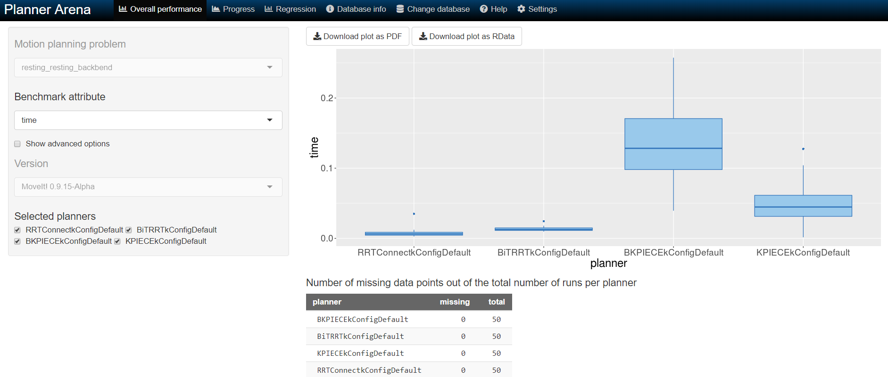

# Parameter Tuning

This package aims to implement the following two papers in researching global blackbox optimisation techniques for automated parameter tuning of motion planning algorithms. 

[Automatic Parameter Tuning of Motion Planning Algorithms (IROS 2018)](http://homepages.inf.ed.ac.uk/jcanore/pub/2018_iros.pdf) 

[Automated Tuning and Configuration of Path Planning Algorithms (ICRA 2017)](http://www.factory-in-a-day.eu/wp-content/uploads/2017/08/Automated_Tuning_SMAC_ICRA_2017.pdf)

## Contents

- [Quick Start](#quick-start)
- [Parameter Tuning Parameters](#parameter-tuning-parameters)
- [MoveIt Planning Time Benchmark](#moveit-planning-time-benchmark)
- Results: [Result Comparison](./results/result_comparison.md)


## Quick Start

Please run setup script if you did not initially setup  with [`crane_plus_setup_FULL.sh`](../crane_plus_setup_FULL.sh). This script installs pip and all required submodules and dependencies to run the all parameter tuning modes.

```bash
$ chmod u+x parameter_tuning_setup.sh && ./parameter_tuning_setup.sh 
```

Launch `control.launch` to:

- Launch Gazebo simulation in tuning mode `tuning:=true` which sets up the [physics properties](http://gazebosim.org/tutorials?tut=modifying_world#PhysicsProperties) in the [tuning_world.world](../crane_plus_simulation/worlds/tuning_world.world) file to speed up realtime simulation
- Launch Moveit config with `robot_execution:=true` to execute on Gazebo.
- You can optionally set `gui:=false` to launch Gazebo without gui.
- You can optionally set `rviz:=false` to launch Moveit without rviz.

```bash
$ roslaunch crane_plus_control.launch control.launch 
```

1. Benchmarking session with OMPL or planner select defaults.

    ```bash
    $ roslaunch crane_plus_control parameter_tuning.launch planner_select:=Cano_etal mode:=default avg_runs:=5
    ```

2. Parameter tuning session with TPE or Random Search using [Hyperopt](http://hyperopt.github.io/hyperopt/).

    ```bash
    $ roslaunch crane_plus_control parameter_tuning.launch mode:=tpe max_runtime:=7200
    ```

3. Parameter tuning session with random Forest using [SMAC](http://www.cs.ubc.ca/labs/beta/Projects/SMAC/v2.10.03/quickstart.html#news).

    Installed from source, located in [/scripts/modules/smac](./scripts/modules/smac).

    ```bash
    $ roslaunch crane_plus_control parameter_tuning.launch mode:=smac max_runtime:=7200
    ```

4. Benchmarking or tuning a specific path with defined start pose and target pose.

    ```bash
    $ roslaunch crane_plus_control parameter_tuning.launch mode:=ompl start_pose:=backbend target_pose:=low_fwd_reach
    ```

**Note:** Please ignore `[WARN] Dropping first 1 trajectory point(s) out of 135, as they occur before the current time. First valid point will be reached in 0.130s.` which outputs before every plan. This is a [known issue](https://github.com/ros-controls/ros_controllers/pull/366/files/7d2f98db49552cab0af753421955071c3cbae8e4#diff-01202b8fd499de6fd52d7a3f43d26df8) that has been patched in newer updates of `ros-kinetic-joint-trajectory-controller`.


## Parameter Tuning Parameters

Launch parameter tuning. Please feel free to adjust the defaults below.
```bash
$ roslaunch crane_plus_control parameter_tuning.launch
```

- **planner_select:** Sets the desired planner configs as described in papers.

  - ***[default]*** Cano_etal
  - Burger_etal
- **mode:** Sets the mode of the parameter tuning session. 

  - ompl - Runs benchmarking session with [OMPL planner config defaults](../crane_plus_moveit_config/config/ompl_planning.yaml).
  - default - Runs benchmarking session with [planner config defaults](./config/planner_configs.yaml).
  - ***[default]*** tpe -  Runs tuning session using Bayesian optimisation with TPE in [Hyperopt](http://hyperopt.github.io/hyperopt/).
  - rand -   Runs tuning session using standard random search in [Hyperopt](http://hyperopt.github.io/hyperopt/).
  - smac - Runs tuning session using SMAC in [SMAC3](https://automl.github.io/SMAC3/master/).
  - auc_bandit - Runs tuning session using AUC Bandit in [OpenTuner](http://opentuner.org/)
  - gp - Runs tuning session using Bayesian optimisation with GP in [skopt](https://scikit-optimize.github.io/)
  - rf - Runs tuning session using sequential optimisation with random forest regressor in [skopt](https://scikit-optimize.github.io/)
  - et - Runs tuning session using sequential optimisation with extra trees regressor in [skopt](https://scikit-optimize.github.io/)
  - gbrt - Runs tuning session using sequential optimisation with gradient boosting tree regressor in [skopt](https://scikit-optimize.github.io/)
- **avg_runs:** Sets the avg number of runs for each parameter configuration. 

  - ***[default]*** 1
- **max_trials:** Sets the max number of trials when in parameter tuning mode.

  - ***[default]*** 30
- **max_runtime: ** Sets the max runtime (secs) in parameter tuning mode. When set, overrides max_trials=10000.

  - ***[default]*** None
- **start_pose**: Sets the start pose for specific path tuning.

  - ***[default]*** None
- **target_pose: ** Sets the target pose for specific path tuning.

  - ***[default]*** None 

    

## MoveIt Planning Time Benchmark

Adapted from [moveit_benchmark_statistics.py](https://github.com/ros-planning/moveit/blob/melodic-devel/moveit_ros/benchmarks/scripts/moveit_benchmark_statistics.py) from MoveIt! framework. See [here](http://docs.ros.org/kinetic/api/moveit_tutorials/html/doc/benchmarking/benchmarking_tutorial.html) for more details on parameter input.

1. Please run setup script if you did not initially setup  with [`crane_plus_setup_FULL.sh`](../crane_plus_setup_FULL.sh).

    ```bash
    $ chmod u+x benchmark_db_setup.sh && ./benchmark_db_setup.sh 
    ```

2. Launch CRANE+V2 simulation. Adjust and save the desired scenes, queries and states to be benchmarked in the MongoDB Warehouse.

    ```bash 
    $ roslaunch crane_plus_moveit_config demo.launch db:=true
    ```

3. Within the *Motion Planning* RViz plugin, connect to the database by pressing the *Connect* button in the *Context* tab.

4. Save a scene on the *Stored Scenes* tab and name it `Scene1` by double clicking the scene in the list.

5. Move the start and goal states of the Crane arm by using the interactive markers.

6. Save an associated query for the `Scene1` scene and name the query `Move1`. Save a start state for the robot on the *Stored States* tab and name it `Start1`. 

7. The config file [benchmark_config.yaml](./config/benchmark_config.yaml) refers to the scenes, queries and start states used for benchmarking. Modify them appropriately.

8. Set the username for the `output_directory` to export the benchmarked files. Log files will be saved to `/home/${USER}/catkin_ws/src/crane_plus_v2_motion_planning/crane_plus_control/results/benchmarks/` by default. 

    ```bash
    $ rosed crane_plus_control benchmark_config.yaml
    ```

9. Bring down your previous `demo.launch` file ( <kbd>Ctrl</kbd> + <kbd>C</kbd>) and run the benchmarks. 

    ```bash
    $ roslaunch crane_plus_control benchmark.launch 
    ```

10. Run [moveit_benchmark_statistics.py](./scripts/moveit_benchmark_statistics.py)  to view results. A `benchmark.db`  and `benchmark_plots` file will appear in the `benchmarks` folder. See `--help` for more options.

    ```bash
    $ rosrun crane_plus_control moveit_benchmark_statistics.py 
    ```

11. Click on the <kbd>Change Database</kbd> button to upload the `benchmark.db` file generated by script to [plannerarena.org](http://plannerarena.org/) to interactively visualise results. 

       

