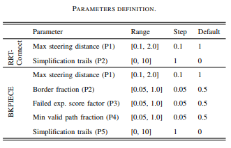
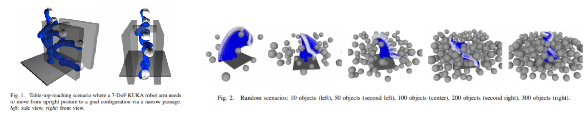

# Parameter Tuning

This package aims to implement the following two papers in researching global blackbox optimisation techniques for automated parameter tuning of motion planning algorithms. 

[Automatic Parameter Tuning of Motion Planning Algorithms (IROS 2018)](http://homepages.inf.ed.ac.uk/jcanore/pub/2018_iros.pdf) 

Cano, J. et al. “Automatic Parameter Tuning of Motion Planning Algorithms,” 2018 IEEE/RSJ International Conference on Intelligent Robots and Systems (IROS), Madrid, Spain,  October, 1-5, 2018

1.  Motion Planning Algorithms: BKPiece and RRTConnect

    

    *Note:* The Simplification trails (P5) parameter is specific to the simulator used in paper, therefore this parameter is omitted in our experiment.

2. Optimisation Algorithms Explored: Random Search, Bayesian Optimisation (Gaussian Process),  Random Forest and AUC Bandit

3. Experiment Setup:

    Simulation only testing for 7DOF KUKA LWR robot arm

    - Environment 1: Tuning planning time on Narrow Passage problem to get optimal parameters with each method  run for a period of 2 hours (7200s) 
    - Environment 2: Tuning planning time on random scenarios with increasing number of objects 

    

4. Results:

    - Environment 1: AUC Bandit gives 4.5x speedup for BKPiece and Random Forest gives 1.26x speedup for RRTConnect

    

    - Environment 2:

    

___

[Automated Tuning and Configuration of Path Planning Algorithms (ICRA 2017)](http://www.factory-in-a-day.eu/wp-content/uploads/2017/08/Automated_Tuning_SMAC_ICRA_2017.pdf)

R. Burger, M. Bharatheesha, M. van Eert and R. Babuška, "Automated tuning and configuration of path planning algorithms," 2017 IEEE International Conference on Robotics and Automation (ICRA), Singapore, 2017, pp. 4371-4376.
doi: 10.1109/ICRA.2017.7989504


## Quick Launch

Launch the simulation in tuning mode, moveit config with robot execution to talk to Gazebo and the parameter tuning launch file.

```bash
$ roslaunch crane_plus_simulation simulation.launch tuning:=true
$ roslaunch crane_plus_moveit_config crane_plus.launch robot_execution:=true
$ roslaunch crane_plus_control parameter_tuning.launch planner_config:=<planner_config> mode:=<mode> avg_runs:=<avg_runs>
```

- **planner_config:** Sets the desired planner config as outlined in [/config/planner_configs.yaml](./config/planner_configs.yaml).
  - [default] Cano_etal
- **mode:** Sets the mode of the parameter tuning session.
  - ompl - Runs a benchmark session with [OMPL planner config defaults](../crane_plus_moveit_config/config/ompl_planning.yaml).
  - default - Runs a benchmark session with planner config defaults in Cano etal paper.
  - [default] tpe -  Runs a TPE parameter tuning session with parameter search space defined in Cano etal paper.
  - rand -  Runs a random search parameter tuning session with parameter search space defined in Cano etal paper.
- **avg_runs:** Sets the avg number of runs for each parameter configuration. 
  - [default] 1

- **max_trials:** Sets the max number of trials when in parameter tuning mode.
  - [default] 30

## Parameter Tuning Modes

1. TPE using [Hyperopt](http://hyperopt.github.io/hyperopt/)

   ```bash
   $ pip install hyperopt
   $ roslaunch crane_plus_control parameter_tuning.launch mode:=tpe max_trials:=30 avg_runs:=1
   ```

1. Random Search using [Hyperopt](http://hyperopt.github.io/hyperopt/)

   ```bash
   $ pip install hyperopt
   $ roslaunch crane_plus_control parameter_tuning.launch mode:=rand max_trials:=30 avg_runs:=1
   ```

1. Random Forest using [SMAC](http://www.cs.ubc.ca/labs/beta/Projects/SMAC/v2.10.03/quickstart.html#news)

   Installed from source, located in [/scripts/modules/smac)](/scripts/modules/smac).

   ```bash
   $ roslaunch crane_plus_control parameter_tuning.launch mode:=smac max_trials:=30 avg_runs:=1
   ```

   

   

## MoveIt Planning Time Benchmark

Adapted from [moveit_benchmark_statistics.py](https://github.com/ros-planning/moveit/blob/melodic-devel/moveit_ros/benchmarks/scripts/moveit_benchmark_statistics.py) from MoveIt! framework. See [here](http://docs.ros.org/kinetic/api/moveit_tutorials/html/doc/benchmarking/benchmarking_tutorial.html) for more details on parameter input.

1. Launch CRANE+V2 simulation. Adjust and save the desired scenes, queries and states to be benchmarked in the MongoDB Warehouse.

    ```bash 
    $ roslaunch crane_plus_moveit_config demo.launch db:=true
    ```

2. Within the *Motion Planning* RViz plugin, connect to the database by pressing the *Connect* button in the *Context* tab.

3. Save a scene on the *Stored Scenes* tab and name it `Scene1` by double clicking the scene in the list.

4. Move the start and goal states of the Crane arm by using the interactive markers.

5. Save an associated query for the `Scene1` scene and name the query `Move1`. Save a start state for the robot on the *Stored States* tab and name it `Start1`. 

6. The config file `/scripts/benchmark_config.yaml` refers to the scenes, queries and start states used for benchmarking. Modify them appropriately.

7. Set the username for the `output_directory` to export the benchmarked files. Log files will be saved to `/home/${USER}/catkin_ws/src/crane_plus_v2_motion_planning/crane_plus_control/results/benchmarks/` by default. 

    ```bash
    $ rosed crane_plus_control benchmark_config.yaml
    ```

8. Bring down your previous `demo.launch` file ( <kbd>Ctrl</kbd> + <kbd>C</kbd>) and run the benchmarks. 

    ```bash
    $ roslaunch crane_plus_control benchmark.launch 
    ```

9. Run `moveit_benchmark_statistics.py`  to view results. A `benchmark.db`  and `benchmark_plots` file will appear in the `benchmarks` folder. See `--help` for more options.

    ```bash
    $ rosrun crane_plus_control moveit_benchmark_statistics.py 
    ```

10. Click on the <kbd>Change Database</kbd> button to upload the `benchmark.db` file generated by script to [plannerarena.org](http://plannerarena.org/) to interactively visualise results. 

    


