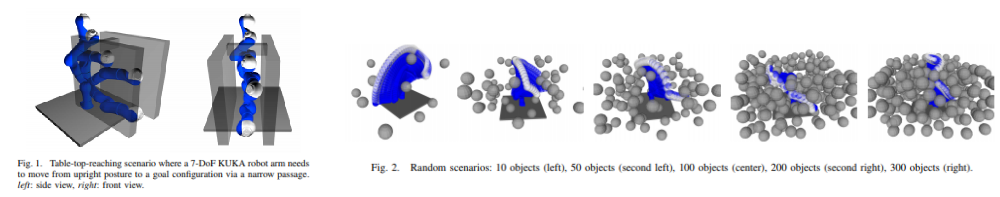
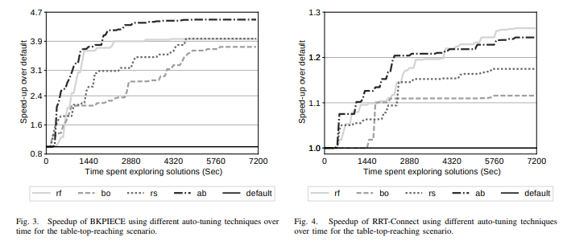

### [Automatic Parameter Tuning of Motion Planning Algorithms (IROS 2018)](http://homepages.inf.ed.ac.uk/jcanore/pub/2018_iros.pdf) 

Cano, J. et al. “Automatic Parameter Tuning of Motion Planning Algorithms,” 2018 IEEE/RSJ International Conference on Intelligent Robots and Systems (IROS), Madrid, Spain,  October, 1-5, 2018

- **Motion Planning Algorithms:** BKPIECE and RRTConnect

  *Note:* The Simplification trails (P5) parameter is specific to the simulator used in paper, therefore this parameter is omitted in our experiment.

  

- **Optimisation Algorithms Explored:** Random Search, Bayesian Optimisation (Gaussian Process),  Random Forest and AUC Bandit

- **Experiment Setup:** Simulation only testing for 7DOF KUKA LWR robot arm

  - ***Environment 1:*** Tuning planning time on Narrow Passage problem to get optimal parameters with each method  run for a period of 2 hours (7200s) 
  - ***Environment 2:*** Tuning planning time on random scenarios with increasing number of objects 

  

- **Results:**

  - ***Environment 1:*** AUC Bandit gives 4.5x speedup for BKPIECE and Random Forest gives 1.26x speedup for RRTConnect

    

    

  - ***Environment 2:*** 

------

### [Automated Tuning and Configuration of Path Planning Algorithms (ICRA 2017)](http://www.factory-in-a-day.eu/wp-content/uploads/2017/08/Automated_Tuning_SMAC_ICRA_2017.pdf)

R. Burger, M. Bharatheesha, M. van Eert and R. Babuška, "Automated tuning and configuration of path planning algorithms," 2017 IEEE International Conference on Robotics and Automation (ICRA), Singapore, 2017, pp. 4371-4376.
doi: 10.1109/ICRA.2017.7989504