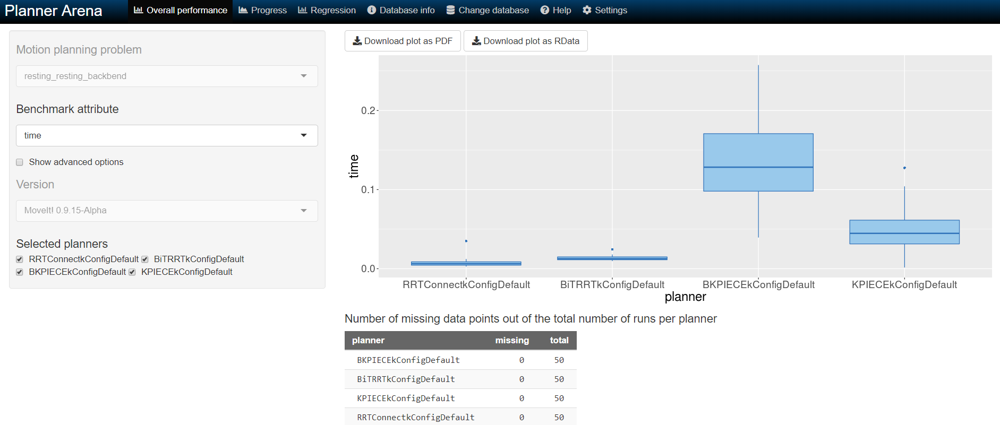

## Benchmarking 

### Planning Time

Adapted from [moveit_benchmark_statistics.py](https://github.com/ros-planning/moveit/blob/melodic-devel/moveit_ros/benchmarks/scripts/moveit_benchmark_statistics.py) from MoveIt! framework. See [here](http://docs.ros.org/kinetic/api/moveit_tutorials/html/doc/benchmarking/benchmarking_tutorial.html) for more details on parameter input.

1. Launch CRANE+V2 simulation. Adjust and save the desired scenes, queries and states to be benchmarked in the MongoDB Warehouse.

    ```bash 
    $ sudo apt-get install mongodb
    $ roslaunch crane_plus_moveit_config demo.launch db:=true
    ```

2. Within the *Motion Planning* RViz plugin, connect to the database by pressing the *Connect* button in the *Context* tab.

3. Save a scene on the *Stored Scenes* tab and name it `Scene1` by double clicking the scene in the list.

4. Move the start and goal states of the Crane arm by using the interactive markers.

5. Save an associated query for the `Scene1` scene and name the query `Move1`. Save a start state for the robot on the *Stored States* tab and name it `Start1`.

6. The config file `crane_plus_control/scripts/benchmark_test.yaml` refers to the scenes, queries and start states used for benchmarking. Modify them appropriately.

7. Bring down your previous `demo.launch` file ( <kbd>Ctrl</kbd> + <kbd>C</kbd>).

8. Change the location `output_directory` to export the benchmarked files.

    ```bash
    $ rosed ~/catkin_ws/src/crane_plus_v2_motion_planning/crane_plus_control/config/benchmark_test.yaml
    ```

    Log files will be saved to `home/$USERNAME/crane_plus_v2_motion_planning/crane_plus_control/moveit_benchmarks/` by default. 

9. Run the benchmarks. 

    ```bash
    $ roslaunch crane_plus_control benchmark.launch 
    ```

10. Run `moveit_benchmark_statistics.py` in `crane_plus_control/scripts/` to view results.

    ```bash
    $ cd ~/catkin_ws/src/crane_plus_v2_motion_planning/crane_plus_control/scripts/
    $ rosrun crane_plus_control moveit_benchmark_statistics.py <path_of_logfile>
    ```

11. To generate a PDF of plots:

     ```bash
     $ python moveit_benchmark_statistics.py <path_to_logfile> -p <plots_filename>
     
     ```

12. To change database name:

      ```bash
      $ python moveit_benchmark_statistics.py <path_to_logfile> -d <dbname>
      ```

13. Click on the <kbd>Change Database</kbd> button to upload the `benchmark.db` file generated by script to [plannerarena.org](http://plannerarena.org/) to interactively visualise results. 




