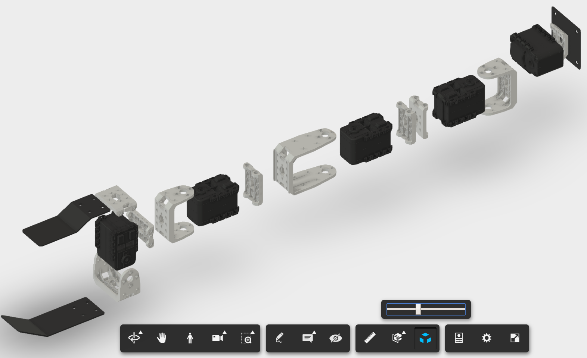
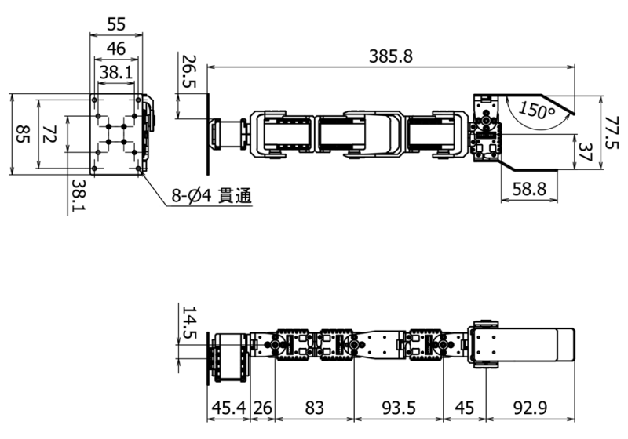

## From Meshes to Assembly

The meshes (STL) for the motors and brackets are identical to the arm of [Bioloid from Robotis](http://www.robotis.us/robotis-premium/) and obtained from [Thingiverse by I-Bioloid](https://www.thingiverse.com/thing:5192). The meshes were imported into [Fusion360](https://www.autodesk.co.jp/products/fusion-360/free-trial), converted to bodies with material properties and assembled (see articles below for Fusion360 help). Follow the links to download the parts.

- [ax12_box](https://a360.co/2TzhdAB)	(Dynamixel motor)
- [f2](https://a360.co/2TyXVvk)			(Small Bracket)
- [f3](https://a360.co/2TuXKRx)			(Joint)
- [f4](https://a360.co/2F7QFTK)			(Long Bracket)
- [f53](https://a360.co/2CSsNRU)			(Base-mount)

- [finger_fixed](https://a360.co/2Fcc2U7)	(adapted from [turtlebot_finger.stl](https://github.com/turtlebot/turtlebot_arm/blob/kinetic-devel/turtlebot_arm_description/meshes/turtlebot_finger.stl))
- [finger_moving](https://a360.co/2TAqfgN) (adapted from [turtlebot_finger.stl](https://github.com/turtlebot/turtlebot_arm/blob/kinetic-devel/turtlebot_arm_description/meshes/turtlebot_finger.stl))
- [mount](https://a360.co/2CUiuwK)

Download the full assembly [here](https://a360.co/2FbPt1S).

## URDF

The assembly can then be converted into the URDF file using [fusion2urdf](https://github.com/syuntoku14/fusion2urdf) which exports:

- .urdf file of the model
- .launch and .yaml files to simulate the robot in Gazebo
- .stl files of the model

Please follow instructions in [README](https://github.com/syuntoku14/fusion2urdf/blob/master/README.md).

## Help

Useful links used to prepare this package:

- [ROS URDF](http://wiki.ros.org/urdf)
  - [Tutorials](http://wiki.ros.org/urdf/Tutorials)
- [Building URDF for CRANE](https://www.rt-shop.jp/blog/archives/6711)
- Fusion360
  - [Scale bodies, components, or sketches](http://help.autodesk.com/view/fusion360/ENU/?guid=GUID-D3F6F79B-1498-48B3-B98C-7D57B620005A)
  - [How to Convert .STL to a Solid Model in Fusion 360](https://www.youtube.com/watch?v=m5v8JO7pEAk)
  - [Edit Material Properties](https://knowledge.autodesk.com/support/fusion-360/getting-started/caas/screencast/Main/Details/981d62b6-30b1-46da-92f4-6693c68bffcf.html)
  - [Manually add joint origins](http://help.autodesk.com/view/fusion360/ENU/?guid=GUID-D1A77DB8-8E42-4BEA-82DA-F51B39635DC0)
  - [How To Assemble Objects](https://www.youtube.com/watch?v=QGHevlSjLQU)

