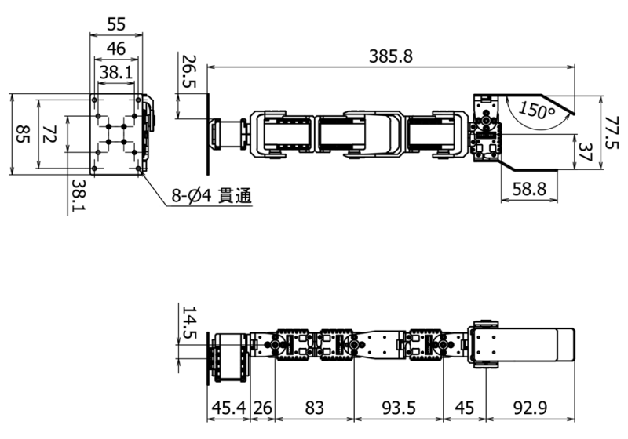

# URDF

Useful links used to prepare this package:

- [ROS URDF](http://wiki.ros.org/urdf)

- [Building URDF for CRANE](https://www.rt-shop.jp/blog/archives/6711)

- [Building a Visual Robot Model with URDF from Scratch](http://wiki.ros.org/urdf/Tutorials/Building%20a%20Visual%20Robot%20Model%20with%20URDF%20from%20Scratch)

## Meshes

The meshes for the following parts are identical to the arm of [Bioloid from Robotis](http://www.robotis.us/robotis-premium/) and obtained from [Thingiverse by I-Bioloid](https://www.thingiverse.com/thing:5192): 

- ax12_box.stl		(Dynamixel motor)
- f2.stl			(Small Bracket)
- f3.stl			(Joint)
- f4.stl			(Long Bracket)
- f53.stl			(Base-mount)

The meshes for the following parts were created in [Fusion360](https://www.autodesk.co.jp/products/fusion-360/free-trial):

- finger_fixed.stl	(adapted from [turtlebot_finger.stl](https://github.com/turtlebot/turtlebot_arm/blob/kinetic-devel/turtlebot_arm_description/meshes/turtlebot_finger.stl))
- finger_moving.stl (adapted from [turtlebot_finger.stl](https://github.com/turtlebot/turtlebot_arm/blob/kinetic-devel/turtlebot_arm_description/meshes/turtlebot_finger.stl))
- mount.stl

